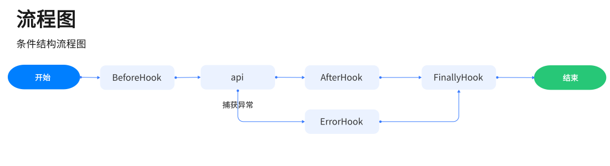
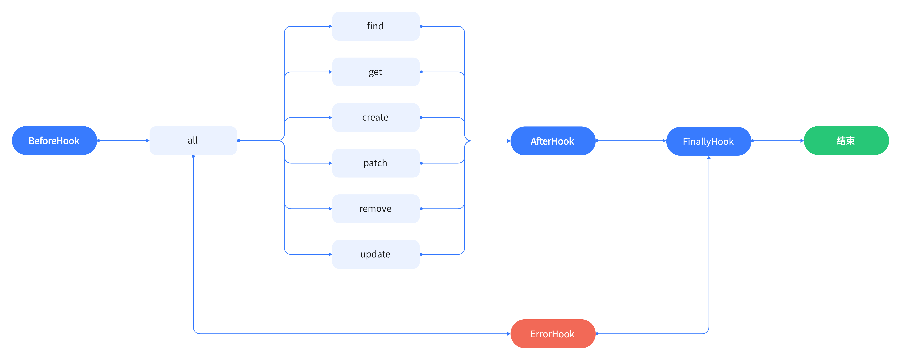
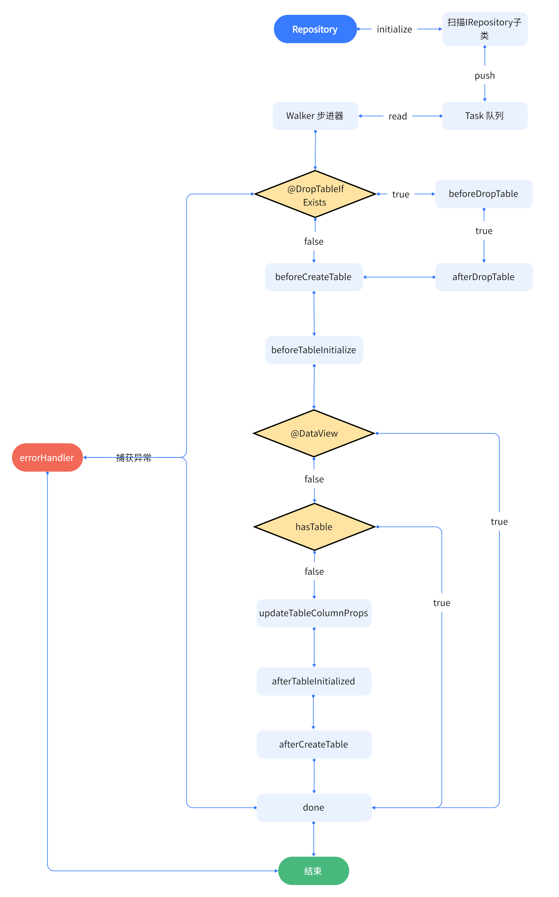

# MagicCube App


## 简介

​	MagicCube是一个兼容Vue & React  两大框架的分布式应用，它可以使你快速构建出一个不需要依赖Java、PHP、.Net、Python的后台应用，因为MagicCube本身就是一款集成了SSR解决方案的服务端应用， 同时MagicCube也集成了一套ORM & IoC 概念模块， 它以极精简的API 接口提供给用户使用，用户只需要基础的相关框架使用经验就可以很好驾驭MagicCube应用。

## MagicCube 能做什么？

- 动态站点，项目具有 SEO 优化需求，或者项目需要SSR技术支持
- 不依赖任何后端开发语言，使用Javascript 开发动态网站
- 一套代码，能够同时兼容Oracle，MySQL , Sql Server， Postgresql 四种数据库操作
- 强大的扩展能力，框架内具有丰富的钩子函数和接口扩展能力， 支持更多用户行为
- 分布式站点，多个MagicCube应用之间可以共享数据信息
- 即时音视频通信模块，简单实现机器人、聊天室、监控传输应用。
-  实体即数据库，快速建立前后台一体项目。

## Installation

### 启动项目

MagicCube 提供一个脚手架功能，辅助用户快速构建应用

```shell
# 安装MagicCube应用脚手架，帮助我们快速构建项目。
npm install -g @skysong/mc-cli
# 初始化一个项目，根据提示步骤完成安装。
mc-cli init
# 进入项目目录，./app 是 init 命令中输入的项目名。
cd ./app
npm config set registry=https://registry.npmmirror.com/
# 安装依赖，并且运行。
npm install
npm run dev
```

运行上述命令后，看到 For Help, see: https://nodejs.org/en/docs/inspector， 打开Chrome浏览器，启动NodeJS调试。

**步骤一：打开Chrome浏览器，输入 chrome://inspect。**

**步骤二：点击[configure...]按钮，配置NodeJS调试地址：localhost:3030**

**步骤三：点击Done.**

**步骤四：Remote Target下面会出现inspect标签内容，点击它，开始新的旅程。**

完成上述步骤后，可以看到我们命令行显示：**info: magic cube application started on http://localhost:8080.** 这里就是我们的前端界面访问地址。

### 脚手架命令

```shell
# mc-cli <command> [options]
# Usage: start [options]
# -v, --vue, 运行Vue 3.0 模板
# -r, --react 运行React 16.8+ 模板
# -vapi, --vue-options-api 是否启用Vue Option API兼容
# -vtools, --vue-prod-devtools 是否启用 Vue Devtools调试工具
# -pro, --pord production 模式启动
# -p, --port 修改inspect断点调试端口,默认是:3030
# 以下两个语法等效.
mc-cli start -v -vapi -vtools
mc-cli start --vue --vue-options-api --vue-prod-devtools
# 如果需要修改inspect断点端口
mc-cli start -v -vapi -vtools -p 3031
# 如果需要运行React环境
mc-cli start -r
mc-cli start --react
# Usage: build [options]
# -v, --vue, 运行Vue 3.0 模板
# -r, --react 运行React 16.8+ 模板
# -vapi, --vue-options-referrerPolicyapi 是否启用Vue Option API 兼容
# -vtools, --vue-prod-devtools 是否启动 Vue Devtools 调试工具
# 生产Vue模板代码
mc-cli build -v
mc-cli build -v -vapi -vtools
# 生产React模板代码
mc-cli build -r
mc-cli build --react

# 使用开发环境启动项目，环境变量 env.NODE_ENV = 'development', 并且启用 source-map 选项。
npm run dev
# 使用开发环境启动项目，环境变量 env.NODE_ENV = 'porduction', 并且关闭 source-map 选项。
npm run prod
# 使用生产环境，与[npm run pord]同效，但是不运行NodeJS持行脚本。
npm run build
```

### 脚手架模板目录结构

#### Vue 项目模板

>|-- app  
>|  |--- dist [生产目录]  
>|  |--- src  [源码目录]  
>|  |   |---- commons [公共脚本]  
>|  |   |    |----- api.ts [ajax 访问后端接口公共代码]  
>|  |   |    |----- router_config.ts [vue-router 前端路由配置代码]  
>|  |   |---- models [数据库实体模型代码目录]  
>|  |   |---- repository [数据库实体操作代码目录]  
>|  |   |    |----- resolver_modules [数据库实体IoC依赖注入模块目录]  
>|  |   |---- services [后端服务实现接口目录]  
>|  |   |    |----- resolver_modules [后端服务IoC依赖注入模块目录]  
>|  |   |---- store [Pinia 前端状态管理代码]  
>|  |   |---- view [前端UI视图界面目录]  
>|  |   |    |----- entry-client.ts [打包项目，SSR 前端入口文件]  
>|  |   |    |----- entry-server.ts [打包项目，SSR 后端入口文件]  
>|  |   |    |----- index.tsx  [UI界面入口文件]  
>|  |   |---- index.ts [工程入口文件]  
>|  |   |---- variables.d.ts [ts 文件支持 sass, scss, css 文件引用兼容文件]  
>|  |--- static [静态资源文件]  
>|  |--- .babelrc [@babel 7+ 配置文件]  
>|  |--- default.ini [项目启动配置文件]  
>|  |--- index.html  
>|  |--- package.json  
>|  |--- tsconfig.json  

#### React 项目模板

>|-- app  
>|  |--- dist [生产目录]  
>|  |--- src  [源码目录]  
>|  |   |---- commons [公共脚本]  
>|  |   |    |----- api.ts [ajax 访问后端接口公共代码]  
>|  |   |    |----- magic-suspense.tsx [React.Suspense不支持SSR, Magic.Suspense补全其模块功能]  
>|  |   |    |----- provide.ts [React 全局状态上下文管理]  
>|  |   |---- models [数据库实体模型代码目录]  
>|  |   |---- repository [数据库实体操作代码目录]  
>|  |   |    |----- resolver_modules [数据库实体IoC依赖注入模块目录]  
>|  |   |---- services [后端服务实现接口目录]  
>|  |   |    |----- resolver_modules  [后端服务IoC依赖注入模块目录]  
>|  |   |---- view [前端UI视图界面目录]  
>|  |   |    |----- entry-client-tsx [打包项目，SSR 前端入口文件]  
>|  |   |    |----- entry-server.tsx [打包项目，SSR 后端入口文件]  
>|  |   |    |----- index.tsx  [React 路由配置文件，也是UI界面入口文件]  
>|  |   |---- index.ts [工程入口文件]  
>|  |   |---- variables.d.ts [ts 文件支持 sass, scss, css 文件引用兼容文件]  
>|  |--- static  [静态资源文件]  
>|  |--- .babelrc  [@babel 7+ 配置文件]  
>|  |--- default.ini [项目启动配置文件]  
>|  |--- index.html  
>|  |--- package.json  
>|  |--- tsconfig.json  

脚手架提供两种主流前端Vue & React框架模板，它们之间的目录内容大同小异，通过脚手架构建出来的环境，可以让你快速进入开发环节。

## 起步

### 创建一个应用

每个根应用都需要一个启动入口实例：

```javascript
import MagicCube from '@skysong/magic-cube'
const mc = new MagicCube.Cube({ config });
```

根应用需要加载全局配置参数，config 是全局配置的入参接口，因此，我们可以在创建根应用之前需要先初始化应用配置参数。

```javascript
import MagicCube from '@skysong/magic-cube'
const config = MagicCube.Config();
const mc = new MagicCube.Cube({ config });
```

> MagicCube.Config() 默认加载当前工作目录中的default.ini文件，如果工作目录中找不到default.ini,则配置对象是一个空的大括号对象({})。

### Config 配置

**config.get(section: string)**

*获取全局配置文件中某个配置项值。*

```ini
# default.ini
[http]
name = "magic app"
cors = true
[http.server]
base = "/api"
extension[] = "js"
extension[] = "css"
```
```javascript
//示例代码
config.get("http.name") => "magic app"
config.get("http.cros") => true
config.get("http.server.base") => "/api"
config.get("http.server.extension") => ["js", "css"]
```

**config.set(section: string, values : Map<string, any>)**

*自定义设置全局配置某个值*

```javascript
//示例代码
config.set("http", { name });
config.set("http.server", { base: "/api", extension: ["js", "css"] });
```

#### default.ini 配置列表

> **default.ini 文件需要放在持行环境目录根下面。**

| 配置名                                         | 类型    | 功能描述                                                     |
| ---------------------------------------------- | ------- | ------------------------------------------------------------ |
| http.name                                      | string  | server 服务名，可以随便填写。                                |
| http.port                                      | number  | server 正确启动时，访问的服务端口。                          |
| http.listener                                  | string  | server 正确启动时，访问的服务地址。                          |
| http.session_name                              | string  | 服务端保存session id的唯一名字，默认是：magic_cube_sid       |
| http.maxSize                                   | string  | 服务端与客户端之间的http通信报文体传输大小。                 |
| http.helmet                                    | boolean | 是否打开http报文头保护，建议开启。                           |
| http.cors                                      | boolean | 是否启用http跨域访问。                                       |
| http.server.base                               | string  | 服务端的控制器访问匹配根地址。                               |
| http.server.staticPrefix                       | string  | 服务端的静态文件逻辑地址前缀。                               |
| http.server.staticDir                          | string  | 服务端的静态文件物理地址。                                   |
| http.server.extension                          | Array   | 服务端扫描静态文件扩展名。                                   |
| [http.helmet]                                  |         |                                                              |
| http.helmet.noSniff                            | boolean | 将X-Content-Type-Options标题设置为nosniff 这减轻了可能导致安全漏洞的MIME 类型嗅探 |
| http.helmet.originAgentCluster                 | boolean | 设置Origin-Agent-Cluster标头，它提供了一种允许 Web 应用程序隔离其源的机制 |
| http.helmet.crossOriginEmbedderPolicy          | boolean | 是否开启防止文档加载任何未明确授予文档权限的跨源资源         |
| http.helmet.ieNoOpen                           | boolean | 设置X-Download-Options特定于 Internet Explorer 8的标头       |
| http.helmet.hidePoweredBy                      | boolean | 删除X-Powered-By在某些框架（如 Express）中默认设置的标头     |
| http.helmet.xssFilter                          | boolean | 通过将X-XSS-Protection标头设置为0                            |
| [http.helmet.contentSecurityPolicy]            | boolean | 是否开启内容安全策略指令。                                   |
| useDefaults                                    | boolean | useDefaults与directives只能两者选其一。                      |
| reportOnly                                     | boolean | 是否让CPS内容安全策略收强制性改为仅产生报告，不具有强制性。  |
| [http.helmet.contentSecurityPolicy.directives] |         |                                                              |
| defaultSrc                                     | Array   | 定义资源默认策略。                                           |
| scriptSrc                                      | Array   | 限制Javascript 源。                                          |
| baseUri                                        | Array   | 限制页面<base>标签源。                                       |
| fontSrc                                        | Array   | 限制通过@font-face 字体源。                                  |
| imgSrc                                         | Array   | 限制图片和图标源。                                           |
| objectSrc                                      | Array   | 限制通过<object>, <embed>,<applet>标签源                     |
| scriptSrcAttr                                  | Array   | 定义<script>标签属性策略                                     |
| frameAncestors                                 | Array   | 用于指定嵌入当前页面的来源。<frame>,<iframe>,<embed>和<applet> |
| styleSrc                                       | Array   | 限制css源                                                    |
| upgrade-insecure-request                       | Array   | 指示User Agent将HTTP更改为HTTPS，重写网址架构。              |
| [http.helmet.crossOriginOpenerPolicy]          |         | 跨源嵌入程序策略。                                           |
| policy                                         | string  | 响应头允许您确保顶级文档不与跨源文档共享浏览上下文组         |
| [http.helmet.crossOriginResourcePolicy]        |         | 跨域资源策略                                                 |
| policy                                         | string  | 响应标头传达了浏览器阻止对给定资源的 no-cors 跨源/跨站点请求的愿望 |
| [http.helmet.expectCt]                         |         | 是否开启有助于缓解错误颁发的SSL证书                          |
| maxAge                                         | number  | 证书有效时间                                                 |
| enforce                                        | boolean | 强制遵守证书透明度政策。                                     |
| reportUri                                      | string  | 用户代理报告地址。                                           |
| [http.helmet.referrerPolicy]                   |         | 报文头Referrer防伪同源信息。                                 |
| policy                                         | string  | 防伪同源验证方案。                                           |
| [http.helmet.hsts]                             |         | 是否强制客户机使用HTTPS与服务器创建连接。                    |
| maxAge                                         | number  | 有效时间，单位秒。                                           |
| includeSubDomains                              | boolean | 如果为true,则这网站的所有子域通过https方式访问。             |
| preload                                        | boolean | 是否预装载。                                                 |
| [http.helmet.dnsPrefetchControl]               |         | 设置X-DNS-Prefetch-Control标头以帮助控制 DNS 预取，这可以以牺牲性能为代价来提高用户隐私 |
| allow                                          | boolean | 开启或关闭。                                                 |
| [http.helmet.frameguard]                       |         | 设置X-Frame-Options标题以帮助您减轻点击劫持攻击              |
| action                                         | string  | deny \| sameorigin \| allow-from                             |
| [http.helmet.permittedCrossDomainPolicies]     |         | 设置X-Permitted-Cross-Domain-Policies标头，它告诉一些客户（主要是 Adobe 产品）您的域加载跨域内容的策略 |
| permittedPolicies                              | string  | "none" \| "master-only" \| "by-content-type" \|"all"         |
| [http.cors]                                    |         | 跨域配置                                                     |
| methods                                        | string  | 允许跨域访问本站点的请求类型。                               |
| allowedHeaders                                 | string  | 允许在报文头中发送跨域字段名。                               |
| exposedHeaders                                 | string  | 允许额外暴露跨域自定义报文头信息。                           |
| credentials                                    | boolean | 允许客户端携带验证信息。                                     |
| preflightContinue                              | boolean | 将 CORS 预检响应传递给下一个处理程序                         |
| [database]                                     |         | 数据库配置                                                   |
| client                                         | string  | 数据库客户端连接类型                                         |
| loggerlfhf                                     | boolean | 是否启用数据库操作日志                                       |
| [database.connection]                          |         | 数据库连接信息                                               |
| host                                           | string  | 数据库连接IP地址。                                           |
| port                                           | number  | 数据库连接端口地址。                                         |
| user                                           | string  | 数据库用户名。                                               |
| passwrod                                       | string  | 数据库密码。                                                 |
| database                                       | string  | 数据库库名。                                                 |
| timeout                                        | number  | 连接超时时间。                                               |
| filename                                       | string  | 连接物理文件名，sqlite3可用。                                |
| [database.pool]                                |         | 数据库连接池                                                 |
| min                                            | number  | 最小连接数。                                                 |
| max                                            | number  | 最大连接数。                                                 |

### Cube 应用实例

**useMultiplexer(multiplexerName: string, multiplexer: typeof IMultiplexer, ...args: any[])**

*设置服务端分发器，分发器是HTTP请求内容处理容器，不同的分发器，处理不同的请求。*

- multiplexerName: String 分发器名称，用于应用实例管理处理容器实例的唯一键值。
- multiplexer: IMultiplexer 分发器类型，Cube根据分发器类型，内部自动创建不同的分发器处理容器。
- args: any[] 分发器处理容器的传参。

```javascript
const mc = new MagicCube.Cube({ config });
mc.useMultiplexer<IRestMultiplexer>("defaultMultiplexer", IRestMultiplexer);
mc.useMultiplexer<IViewMultiplexer>("viewMultiplexer", IViewMultiplexer, "./dist/index.html", CreateVueRoot(EntryVueSetup));
```

**dependencyResolvers(...module : Array<IServiceSynchResolverModule | IServiceAsyncResolverModule>)**

*IoC依赖注入加载器，加载器分同步和异步加载方式，module 必须是实现依赖注入绑定接口的类。*

- module: IServiceSynchResolverModule | IServiceAsyncResolverModule 依赖注入模块加载器实现。

```javascript
/// serivce_syncjavascripth_resolve_module.ts
import { interfaces } from 'inversify'
import { IServiceSynchResolverModule, HttpService } from '@skysong/magic-cube'
export default class ServiceSynchResolverModule implements IServiceSynchResolverModule {
  constructor () {
    this.registry = this.loader
  }
  id!: number
  public registry!: interfaces.ContainerModuleCallBack
  public get loader(): interfaces.ContainerModuleCallBack {
    return (bind, unbind, isBound, rebind) => {
      bind<HttpService<any>>(Symbol.for('magic:rest')).to(UserService);
    }
  }  
}
/// main.ts
const mc = new MagicCube.Cube({ config });
mc.dependencyResolvers(new ServiceSynchResolverModule(), new RepositorySynchResolverModule());
```

**Run()**

*开始启动服务函数。主要完成服务的安全性加载、服务的注册等工作内容。*

```javascript
const mc = new MagicCube.Cube({ config });
mc.Run();
```

### IMultiplexer 分发器

分发器是Cube内部核心之一，它们有一个共同的父接口《IMultiplexer》，目前Cube只公开IRestMultiplexer、IViewMultiplexer、IFileMultiplexer三个已实现的类，已足够当前需求，未来可能会公开IMultiplexer，让用户自定义更强大的分发器容器，让Cube更强大。

#### IRestMultiplexer 分发器

Restful Api 请求的处理器，主要处理将Restful Api HTTP请求映射给实现《HttpService》接口的服务类，GET、PUT、POST、DELETE、PATCH请求分别对应《HttpService》中的find、get、update、create、remove、patch等函数。

```javascript
@ApiController("/api/user")
class UserService extends HttpService<User> {
	///查询列表 http://localhost:8080/api/user, method:get
    public async find(params?: Params): Promise<User | User[] | Paginated<User>>;
    ///获取单例 http://localhost:8080/api/123?arg1=xxx&arg2=xxx, method: get
    public async get(id: Id, params?: Params): Promise<User>;
	///新增 http://localhost:8080/api/user, method:post, application/json: { "id": '123', "name": 'test1'}
    public async create(data: Partial<User> | Array<Partial<User>>, params?: Params): Promise<User | User[]>;
	///新增或修改 http://localhost:8080/api/user/123, method:patch, application/json: { "name": 'test1'}
    public async patch(id: Id, data: Partial<User>, params?: Params): Promise<User | User[]>;
	///删除 http://localhost:8080/api/user/123?arg1=xxx&arg2=xxx, method:delete
    public async remove(id: Id, params?: Params): Promise<User | User[]>;
    ///修改 http://localhost:8080/api/user/123, method:put, application/json: { "name": 'test1'}
    public async update(id: Id, data: User, params?: Params): Promise<User | User[]>;
}
```

#### IViewMultiplexer分发器

页面视图内容处理器，处理HTTP请求地址的html输出内容，并且已实现Vue & React SSR技术，动态处理解析Vue或React组件UI内容，让用户轻松使用SSR技术。

```html
<!--index.html-->
<!DOCTYPE html>
<html lang="en">
    <head>
        <title><%= htmlWebpackPlugin.options.title %></title>
    </head>
    <body>
        <div id="app"><!-- vue ssr output --></div>
    </body>
</html>
```

index.html 是Vue & React 组件挂载内容的地方，其中 <!-- vue ssr output --> 是entry-server 服务端渲染内容的标记， id="app" 是entry-client 客户端渲染挂载内容的入口。

##### Vue SSR 挂载


```javascript
/// entry-server.ts
import { createSSRApp } from 'vue'
import { createRouter, createMemoryHistory } from 'vue-router'
import { renderToString } from '@vue/server-renderer'

export default (iniConfig: any) => {
	// 创建SSR APP对象
    const app = createSSRApp(App);
	// 挂载服务端内存路由
    const router = createRouter({
        history: createMemoryHistory(
            //设置前端请求路径与服务端路径同步
            iniConfig.get("http.server").base
        ),
        routes: routerConfig.getRouter()
    })

    app.use(router)
    return { vue : app, router, store : pinia, transform: (SSRApp : any) => Promise.resolve(renderToString(SSRApp)) }
}
/// main.ts Vue挂载SSR内容
import MagicCube, { CreateVueRoot } from '@skysong/magic-cube'
import EntryVueSetup from './entry-server'

const mc = new MagicCube.Cube({ config });
mc.useMultiplexer<IViewMultiplexer>("viewMultiplexer", IViewMultiplexer, "./dist/index.html", CreateVueRoot(EntryVueSetup));
```

##### React SSR 挂载

```javascript
/// entry-server.ts
import * as React from 'react'
import { createStore } from 'redux'
import { renderToString } from 'react-dom/server'
import { StaticRouter } from 'react-router-dom/server'

import App from './index'
export default (iniConfig: any) => {
    const store = createStore((state, payload) => state);
    const router = <App base={ iniConfig.get("http.server").base } />

    return { 
        react : router, router, store, transform: (props: any) => Promise.resolve(renderToString(<StaticRouter basename={ props.basename } children={ props.children } location={ props.location } ></StaticRouter>)) 
    }
}
/// main.ts React挂载SSR内容
import MagicCube, { CreateReactRoot } from '@skysong/magic-cube'
import EntryReactSetup from './entry-server'

const mc = new MagicCube.Cube({ config });
mc.useMultiplexer<IViewMultiplexer>("viewMultiplexer", IViewMultiplexer, "./dist/index.html", CreateReactRoot(EntryReactSetup));
```

@skysong/magic-cube 提供CreateVueRoot & CreateReactRoot 两个工厂方法兼容Vue 平台和React平台SSR需求的具体实现，只需要用户关注页面组件逻辑视图编写即可。

#### IFileMultiplexer 分发器

文件分发处理器，针对HTTP文件断点上传、下载等需求功能实现。（暂不公开）

### HttpService 服务

HttpService 服务是http restful 风格api 的接口约束，只有实现HttpService接口类，才能被IRestMultiplexer正确扫描到，并注册成http服务入口，HttpService提供了合理的钩子函数和请求处理函数。

> 注意：HttpService 需要配合@ApiController修饰符使用，@ApiController 与 Vue-Router 服务端中定义的路由需要唯一，冲突可能会导致某个请求不可使用。供了合理的钩子函数和请求处理函数。

#### Restful Api 接口

**find(params ?: Params) Promise<T[]> | T[]**

*Get 请求， 用于获取数据列表。请求如 ：http://localhost:8080/api/user?args=123*

- params: { query, paginate, route, headers ... } Get请求参数信息。

```javascript
import { Paginated, Params } from '@feathersjs/feathers'
import { ApiController, HttpService } from '@skysong/magic-cube'
import User from './user'
// 方式一
@ApiController("/api/user")
class UserService extends HttpService<User> {
    public async find(params?: Params): Promise<User | User[] | Paginated<User>> {
    
    }
}
// 方式二
@ApiControler("/api/user")
class UserService extends HttpService<User> {
    public find(params?: Params): Promise<User | User[] | Paginated<User>> {
    
    }
}
```

**get (id: Id, params?: Params): Promise<T> | T**

*Get请求， 用于获取某个唯一数据，请求如：http://localhost:8080/api/user/1?args=123*

- id: Id 用于匹配HTTP路径段中的ID段。
- params: { query, paginate, route, headers ... } Get请求参数信息。

```javascript
import { Id, Paginated, Params } from '@feathersjs/feathers'
import { ApiController, HttpService } from '@skysong/magic-cube'
import User from './user'
// 方式一
@ApiController("/api/user")
class UserService extends HttpService<User> {
    public async get(id: Id, params?: Params): Promise<User> {
    
    }
}
// 方式二
@ApiControler("/api/user")
class UserService extends HttpService<User> {
    public get(id: Id, params?: Params): Promise<User> {
    
    }
}
```

**create(data: Partial<T> | Array<Partial<T>>, params?: Params) : Promise<T | T[]> | T | T[]**

*Post请求， 用于添加一条或多条数据， 请求如：http://localhost:8080/api/user*

- data: Partial<T> | Array<Partial<T>> application/json 格式数据。
- params:  { query, paginate, route, headers ... } POST请求参数信息。

```javascript
import { Id, Paginated, Params } from '@feathersjs/feathers'
import { ApiController, HttpService } from '@skysong/magic-cube'
import User from './user'
// 方式一
@ApiController("/api/user")
class UserService extends HttpService<User> {
    public async create(data: Partial<User> | Array<Partial<User>>, params?: Params): Promise<User | User[]> {
    
    }
}
// 方式二
@ApiControler("/api/user")
class UserService extends HttpService<User> {
    public create(data: Partial<User> | Array<Partial<User>>, params?: Params): User | User[] {
    
    }
}
```

**patch(id: Id, data: Partial<T>, params?: Params) : Promise<T | T[]> | T | T[]**

*Patch 请求， 用于添加或更新一条数据， 请求如：http://localhost:8080/api/user*

- id: Id 用于匹配HTTP路径段中的ID段。
- data: Partial<T> application/json 格式数据。
- params:  { query, paginate, route, headers ... } POST请求参数信息。

```javascript
import { Id, Paginated, Params } from '@feathersjs/feathers'
import { ApiController, HttpService } from '@skysong/magic-cube'
import User from './user'
// 方式一
@ApiController("/api/user")
class UserService extends HttpService<User> {
    public async patch(id: Id, data: Partial<User>, params?: Params): Promise<User | User[]> {
    
    }
}
// 方式二
@ApiControler("/api/user")
class UserService extends HttpService<User> {
    public patch(id: Id, data: Partial<User>, params?: Params): User | User[] {
    
    }
}
```

**remove(id: Id, params?: Params) : Promise<T | T[]> | T | T[]**

*Delete 请求， 用于删除一条记录，返回删除的记录。*

- id: Id 用于匹配HTTP路径段中的ID段。
- params:  { query, paginate, route, headers ... } POST请求参数信息。

```javascript
import { Id, Paginated, Params } from '@feathersjs/feathers'
import { ApiController, HttpService } from '@skysong/magic-cube'
import User from './user'
// 方式一
@ApiController("/api/user")
class UserService extends HttpService<User> {
    public async remove(id: Id, params?: Params): Promise<User | User[]> {
    
    }
}
// 方式二
@ApiControler("/api/user")
class UserService extends HttpService<User> {
    public remove(id: Id, params?: Params): Promise<User | User[]> {
    
    }
}
```

**update(id: Id, data: T, params: Params): Promise<T | T[]> | T | T[]**

*Put请求， 用于更新一条记录，返回更新的数据。*

- id: Id 用于匹配HTTP路径段中的ID段。
- params:  { query, paginate, route, headers ... } POST请求参数信息。

```javascript
import { Id, Paginated, Params } from '@feathersjs/feathers'
import { ApiController, HttpService } from '@skysong/magic-cube'
import User from './user'
// 方式一
@ApiController("/api/user")
class UserService extends HttpService<User> {
    public async update(id: Id, data: User, params?: Params): Promise<User | User[]> {
    
    }
}
// 方式二
@ApiControler("/api/user")
class UserService extends HttpService<User> {
    public update(id: Id, data: User, params?: Params): Promise<User | User[]> {
    
    }
}
```

#### HttpService 请求生命周期



##### Hook 钩子函数

钩子函数主要是在整个请求生命周期过程中，对特定的业务需求定制特别内容，主要是干预请求行为的一个入口。

> BeforeHook: 请求到达Api接口之前触发，包含有请求的信息和内容。
>
> AfterHook: 请求在Api返回结果之后触发，包含BeforeHook信息以外，还包含Api请求的结果内容。
>
> FinallyHook: 请求在所有钩子函数持行完成之后触发，包含持行过钩子函数的特点内容。
>
> ErrorHook: 请求在Api接口出现代码异常时触发，包含异常信息内容。



**如何使用钩子函数**

```javascript
import { ApiController, HttpService } from '@skysong/magic-cube'
import User from '../models/user'

const fn = (context) => { let { method, type } = context; console.log("hook:", method, type) };

@ApiController("/api/user")
class UserService extends HttpService<User> {
    
	get afterHooks() {
        return {
            all: [fn]
        }
    }
    
    get beforeHooks() {
        return {
            all: [fn]
        }
    }

	get errorHooks() {
        return {
            all: [fn]
        }
    }

	get finallyHooks() {
        return {
            all: [fn]
        }
    }
}
```

**不同请求的钩子使用**

```javascript
import { ApiController, HttpService } from '@skysong/magic-cube'
import User from '../models/user'

const fn = (context) => { let { method, type } = context; console.log("hook:", method, type) };

@ApiController("/api/user")
class UserService extends HttpService<User> {
    
	get afterHooks() {
        return {
            all: [fn],
            find: [fn],
            get: [fn],
            create: [fn],
            patch: [fn],
            remove: [fn],
            update: [fn]
        }
    }
}
```

**修饰符方式使用钩子函数**

```javascript
import { ApiController, BeforeHook, HttpService } from '@skysong/magic-cube'
import User from '../models/user'

const fn = (context) => { let { method, type } = context; console.log("hook:", method, type) };

@ApiController("/api/user")
@BeforeHook(fn)
class UserService extends HttpService<User> {
}
```

**修饰符与钩子使用关系**

```javascript
import { ApiController, BeforeHook, AfterHook, HttpService } from '@skysong/magic-cube'
import User from '../models/user'

const fn = (context) => { let { method, type } = context; console.log("hook:", method, type) };
// 示例一
@ApiController("/api/user")
@BeforeHook(fn)
class UserService extends HttpService<User> {}
// 等价于
class UserService extends HttpService<User> {
    get beforeHooks() {
        return {
            all: [fn]
        }
    }
}

// 示例二
@ApiController("/api/user")
class UserService extends HttpService<User> {
	@BeforeHook(fn)
    public async find(params?: Params): Promise<User | User[] | Paginated<User>> {}
}
//等价于
class UserService extends HttpService<User> {
    get beforeHooks() {
        return {
            find: [fn]
        }
    }
}

//示例三
@ApiController("/api/user")
class UserService extends HttpService<User> {
    @AfterHook(fn)
    public async find(params?: Params): Promise<User | User[] | Paginated<User>> {}
}
// 等价于
class UserService extends HttpService<User> {
    get afterHooks() {
        return {
            find: [fn]
        }
    }
}

//@ErrorHook, @FinallyHook 参考上述类推使用。
```

### IRepository 数据库服务

MagicCube框架集成了一套ORM模型数据库支持API，它实现了一部份业务逻辑接口，同时也实现了模型即数据库，项目配置启动，框架则根据代码配置，自动生成数据库，不需要手动去建库，大大提高快速开发。

IRepository 是数据库模型接口(interface)隔离，框架中具体实现ORM数据库功能的是Business_UnitRepositroy实现类，因此MagicCube 暴露出来的接口中是Business_UnitRepositroy，如果你对ORM数据实现感兴趣，你可以继承IRepository，重写Business_UnitRepositroy方式定制自己的模型。

#### 如何启用数据库

```ini
# 查看项目根目录 default.ini 文件
[database]
; 连接客户端类型, mysql, oracle, postgresql, mssql, sqlite3
client = "mysql"
; log 日志是否启用
logger = true
; 连接配置项
[database.connection]
; 数据库服务tcp地址
host = "localhost"
; 数据库服务tcp端口
port = 3306
; 数据库用户名
user = "root"
; 数据库密码
password = "123456"
; 数据库库名
database = "magic"
; Oracle 数据库连接字符串
; connectString = "(DESCRIPTION = (ADDRESS_LIST = (ADDRESS = (PROTOCOL = TCP)(HOST = 127.0.0.1)(PORT = 1521))) (CONNECT_DATA = (SERVER = DEDICATED)(SERVICE_NAME = ORCL)))"
; 数据Socket连接地址，当tcp连接无效时，可以使用Socket连接。
; socketPath = "/tmp/socket.sock",
; 连接超时时间（秒）
timeout = 6000
; sqlite3 连接方式配置
; filename = ":memory:"
; sqlite3 连接方式参数
; flags[] = 'OPEN_URI'
; flags[] = 'OPEN_SHAREDCACHE'
[database.pool]
; 连接池最小值
min = 0
; 连接池最小值
max = 100
```

#### **如何建表**

```javascript
import {
    DataTable,
    TableColumn, 
    NullableColumn, 
    NotNullableColumn, 
    UniqueColumn, 
    PrimaryColumn, 
    ForeignColumn, 
    TableColumnEnum,
    DropTableIfExists,
    Business_UnitRepositroy
} from "@skysong/magic-cube"
import User from '../models/user'

@DropTableIfExists()
@DataTable("user", "innodb", "utf8mb4", "utf8mb4_general_ci")
export default class extends Business_UnitRepositroy<User> {

    @TableColumn('id', TableColumnEnum.String, "主键唯一", [30])
    @PrimaryColumn()
    @NotNullableColumn()
    id !: string;

    @TableColumn('name', TableColumnEnum.String, "用户名", [50])
    @UniqueColumn({ indexName: "idx_user_name", deferrable: "not deferrable", storageEngineIndexType: "btree", useConstraint: true })
    @NotNullableColumn()
    name !: string

    @TableColumn('age', TableColumnEnum.Integer, "年龄", [2])
    @NotNullableColumn()
    age !: number

    @TableColumn('email', TableColumnEnum.String, "email", [50])
    @NullableColumn()
    eMail !: string

    @TableColumn('sex', TableColumnEnum.BigInteger, "性别", [1])
    @NullableColumn()
    sex !: boolean

    @TableColumn('deptid', TableColumnEnum.String, "部门id", [30])
    @ForeignColumn("id", "department", "user", { onDelete: "CASCADE", onUpdate: "CASCADE" })
    @NotNullableColumn()
    deptid !: string;
    
}
```

#### **如何建视图**

```javascript
import {
    DataView,
    TableColumn,
    DropTableIfExists,
    TableColumnEnum,
    Business_UnitRepositroy
} from '@skysong/magic-cube'

import Model from '../models/view'

@DropTableIfExists()
@DataView("jurisdiction", "select u.id, u.`name`, u.email, d.`name` department_name, r.`name` role_name  from `user` u inner join department d on (u.deptid = d.id) inner join user_role ur on (u.id = ur.userid) inner join role r on (r.id = ur.roleid)")
export default class extends Business_UnitRepositroy<Model> {

    @TableColumn("id", TableColumnEnum.String, "主键", [30])
    id !: string;

    @TableColumn("name", TableColumnEnum.String, "名称", [30])
    name !: string;

    @TableColumn("email", TableColumnEnum.String, "邮箱", [30])
    email !: string;

    @TableColumn("department_name", TableColumnEnum.String, "部门名称", [30])
    department_name !: string;

    @TableColumn("role_name", TableColumnEnum.String, "角色名称", [30])
    role_name !: string;

}
```

#### 建库的钩子函数

MagicCube在启动的时候，会自动扫描数据库实现类，根据类的修饰符信息，自动创建表、视图、索引、外键、主键、关系等等，在这个过程当中，同时也有钩子函数被触发。

> $beforeDropTable: @DropTableIfExists 钩子函数，在创建表之前，如果该表存在，则触发此钩子函数。支持async & Promise操作。
>
> $afterDropTable:  @DropTableIfExists 规则正常持行，并且当前存在example表存在，则此钩子是表被删除后调用。
>
> $beforeCreateTable: 创建表之前持行。钩子函数被调用时，通过返回值判断是否创建表。
>
> $beforeTableInitialize: 创建表之后，初始化表的特性之前持行。$beforeCreateTable 返回值为 true, 则此函数持行，反之不会持行。
>
> $updateTableColumnProps: 创建表后，初始化表字段特性时持行。$beforeCreateTable 返回值为 true, 则此函数持行，反之不会持行。
>
> $afterTableInitialized: 表特性、字段、索引等特性完成初始化后持。$beforeCreateTable 返回值为 true, 则此函数持行，反之不会持行。
>
> $afterCreateTable: 创建表之后持行，$beforeCreateTable 返回值为 true, 则此函数持行，反之不会持行。
>
> $done: 创建表完成钩子，此钩子函数不受任何钩子函数影响。
>
> $errorHandler: 整个建表流程中，当出现代码或SQL异常，将会在这里捕获。



```javascript
import {
    DataTable,
    DropTableIfExists,
    Business_UnitRepositroy
} from '@skysong/magic-cube'
import Example from '~/models/example'

@DropTableIfExists()
@DataTable("example", "innodb", "utf8mb4", "utf8mb4_general_ci")
export default class example extends Business_UnitRepositroy<Example>{

    /**
     * @return {*} true 阻止数据表被删除, 反之则遵守 @DropTableIfExists 规则。
     */    
    $beforeDropTable(trx: any) : boolean | Promise<boolean> {
        return false;
    }

    async $afterDropTable(trx: any) : Promise<void> { }

    /**
     * @return {*} true 创建表， false 阻止表被创建。
     */    
    $beforeCreateTable(trx: any) : boolean | Promise<boolean> {
        return true;
    }

    $beforeTableInitialize(trx: any) : Promise<void> | void { }

    $updateTableColumnProps(trx: any, table: any, columnName : string, state : any) : Promise<void> | void  { }

    $afterTableInitialized(trx: any, table: any) : Promise<void> | void { }

    $afterCreateTable(trx: any) : Promise<void> | void{ } 

    $done(trx: any) : Promise<void> | void { }

    $errorHandler(error : any) : Promise<void> | void { }
}
```

#### 服务如何调用Repository

> 我们需要先实现  IServiceSynchResolverModule 或者 IServiceAsyncResolverModule 注入接口，两者的区别只在于一个是异步、一个是同步运行。

```javascript
import { interfaces } from 'inversify'
import MagicCube, { 
    IServiceSynchResolverModule, 
    ConnectionFactory 
} from '@skysong/magic-cube'
import UserRepository from './user_repositroy'

export default class RepositorySynchResolverModule implements IServiceSynchResolverModule {
  constructor () {
    this.registry = this.loader
  }
 
  id!: number
 
  public registry!: interfaces.ContainerModuleCallBack
  
  public get loader(): interfaces.ContainerModuleCallBack {
     return (bind, unbind, isBound, rebind) => {
       const config = MagicCube.Config();
bind(Symbol.for('magic:dbContext')).toDynamicValue(ConnectionFactory(config.get("database"))).inSingletonScope();
bind(Symbol.for('magic:table')).to(UserRepository).whenTargetNamed(Symbol.for('magic:user'));
     }
   }
 }
```

> 完成了注入接口的配置后，我们就可以在服务类里面通过@Repository来调用数据库。

```javascript
import { Id, Paginated, Params } from '@feathersjs/feathers'
import { ApiController, HttpService, Repository, Business_UnitRepositroy } from '@skysong/magic-cube'
import User from './models/user'

@ApiController("/api/user")
class UserService extends HttpService<User> {

    constructor() {
        super();
    }

    @Repository(Symbol.for('magic:user'))
    private userRepository !: Business_UnitRepositroy<User>;

    public async find(params?: Params): Promise<User | User[] | Paginated<User>> {
        const me = this;
        me.state = 200;
        return me.userRepository.find();
    }

    public async get(id: Id, params?: Params): Promise<User> {
        const me = this;;
        me.state = 200;
        const result =  ((await me.userRepository.get(id)) || new User());
        return result;
    }
}
```

### 修饰符

| 修饰符              | 描述                                                        |
| ------------------- | ----------------------------------------------------------- |
| @ApiController      | api 地址路由                                                |
| @BeforeHook         | Api HTTP 请求管道钩子, 在请求到达处理器之前持行             |
| @AfterHook          | Api HTTP 请求管道钩子, 在请求在处理器持行完成之后持行       |
| @ErrorHook          | Api HTTP 请求管道钩子, 钩子函数只有在处理器中发生异常时持行 |
| @FinallyHook        | Api HTTP 请求管道钩子, 钩子函数总是会在处理器之后持行       |
| @DropTableIfExists  | ORM模式启动时自动检测是否删除已存在的表                     |
| @DataTable          | ORM模式中表信息修饰器                                       |
| @Repository         | ORM模式获取DI容器数据库实例对象                             |
| @DataView           | ORM模式中表视图修饰器                                       |
| @TableColumn        | ORM模式中与表字段中对应关系映射和字段类型描述修饰器         |
| @DefaultValueColumn | ORM模式中表字段默认值,只支持数据库.                         |
| @NullableColumn     | ORM模式中表字段是否允许为NULL修饰器                         |
| @NotNullableColumn  | ORM模式中表字段是否不为NULL修饰器                           |
| @IndexColumn        | ORM模式中表字段的索引修饰器                                 |
| @UniqueColumn       | ORM模式中表字段唯一索引修饰器                               |
| @PrimaryColumn      | ORM模式中表字段主键修饰器                                   |
| @ForeignColumn      | ORM模式中表外键修饰器                                       |
| @IgnoreColumn       | 忽略字段在表中生成。                                        |
| @IncrementsColumn   | ORM模式中表字段自增修饰器                                   |

### 疑难杂症

- windows 10  PowerShell 持行脚本显示 npm: 无法加载文件 C:\\\nodejs\npm.ps1, 因为在此系统上禁止运行脚本。


```powershell
set-executionpolicy remotesigned
```

- NJS-05：connot load a node-oracledb binary for Node.js 16.xx.xx (win32 x64) Looked for C:\xxxx

  Oracel 连接需要安装Client端驱动才能使用，详细原理查看：https://oracle.github.io/node-oracledb/INSTALL.html.

```shell
# Windows 
LD_LIBRARY_PATH=C:\oracle_client_install
# Linux
export LD_LIBRARY_PATH=/usr/local/oracle_client_install
```

## License

The MIT License (MIT)

Copyright © 2020-2030 宋骞 <onlylove1172559463@vip.qq.com>

Permission is hereby granted, free of charge, to any person obtaining a copy
of this software and associated documentation files (the "Software"), to deal
in the Software without restriction, including without limitation the rights
to use, copy, modify, merge, publish, distribute, sublicense, and/or sell
copies of the Software, and to permit persons to whom the Software is
furnished to do so, subject to the following conditions:

The above copyright notice and this permission notice shall be included in all
copies or substantial portions of the Software.

THE SOFTWARE IS PROVIDED "AS IS", WITHOUT WARRANTY OF ANY KIND, EXPRESS OR
IMPLIED, INCLUDING BUT NOT LIMITED TO THE WARRANTIES OF MERCHANTABILITY,
FITNESS FOR A PARTICULAR PURPOSE AND NONINFRINGEMENT. 

IN NO EVENT SHALL THE AUTHORS OR COPYRIGHT HOLDERS BE LIABLE FOR ANY CLAIM, DAMAGES OR OTHER LIABILITY, WHETHER IN AN ACTION OF CONTRACT, TORT OR OTHERWISE, ARISING FROM, OUT OF OR IN CONNECTION WITH THE SOFTWARE OR THE USE OR OTHER DEALINGS IN THE SOFTWARE.